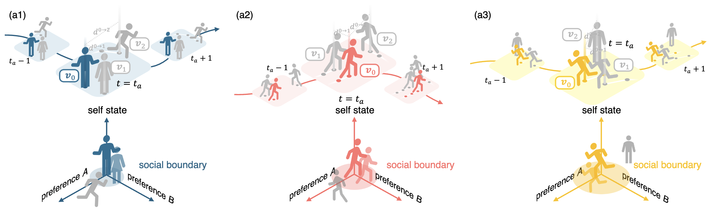

<!--
 * @Author: Conghao Wong
 * @Date: 2024-12-27 11:05:08
 * @LastEditors: Ziqian Zou
 * @LastEditTime: 2026-09-21 18:40:16
 * @Github: https://cocoon2wong.github.io
 * Copyright 2024 Conghao Wong, All Rights Reserved.
-->

## Information

This is the homepage of our paper "Socialality Anchors: Towards Group-bounded Trajectory Prediction".
The paper will be available on arXiv.
Click the buttons below for more information.

<div style="text-align: center;">
    <!--  -->
    <!-- <a class="btn btn-lg btn-normal" href="./paper">📖 Paper</a> -->
    <!--  -->
    <a class="btn btn-lg btn-normal" href="{{ site.github.repository_url }}">🛠️ Code</a>
    <a class="btn btn-lg btn-normal" href="./guidelines">💡 Code Guidelines</a>
    <br><br>
</div>

## Abstract



*Fig. Motivation Illustration: By observing the agent-wise preferences when grouping with others over a period of time, we mainly focus on how to infer each target agent's social boundary, which will anchor its group affiliation.*

Trajectory prediction is a key component for understanding human behavior patterns in dynamic scenes.
Researchers have devoted substantial efforts to modeling social interactions, especially group-wise interactions, since group membership often reflects shared intention, coordinated motion, and stable mutual adaptation, thus providing a persistent and semantically meaningful social prior for forecasting.
However, existing group modeling methods may rely on a fixed threshold and infer groups mainly from agents' relative positions within the observation window, overlooking the fact that grouping rules should be agent-specific, temporally coherent, and context-adaptive across diverse personalities, culturalities, and evolving interaction contexts.
Inspired by human social perception that alternates between interpersonal distance in boundary-sensitive situations and relative speed consistency in dynamic interactions, we propose *Socialality*, a human-inspired trajectory prediction framework with interpretable *socialality* anchors and an extended grouping window for stable, context-aware grouping inference.
Concretely, *Socialality* introduces a duo-scalar-controlled grouping kernel *Socialality* that jointly leverages historical observations and short-term future trajectory previews to learn agent-specific grouping rules, and employs a group-wise perception mechanism to model in-group and out-of-group interactions in an intuitive and explainable manner.
Furthermore, we conduct extensive experiments on standard benchmarks to demonstrate the performance gains of *Socialality*, and provide qualitative analyses and statistical studies of anchor distributions to verify the interpretability and stability of the proposed *socialality* anchors.

## Citation

If you find this work useful, it would be grateful to cite our paper!

```bib
TBA
```

## Contact us

Ziqian Zou ([@LivepoolQ](https://github.com/LivepoolQ)): ziqianzoulive@icloud.com  
Conghao Wong ([@cocoon2wong](https://github.com/cocoon2wong)): conghaowong@icloud.com  
